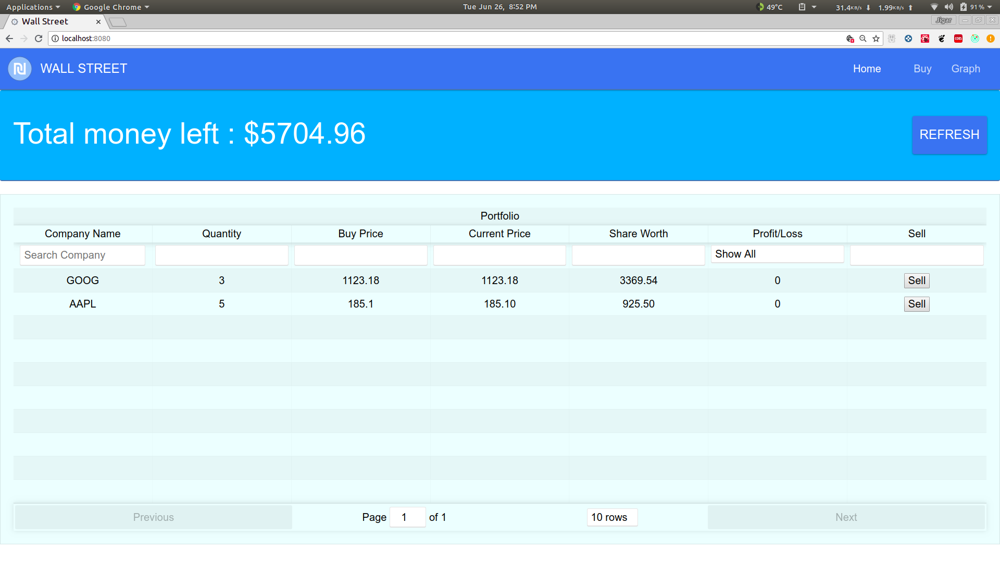
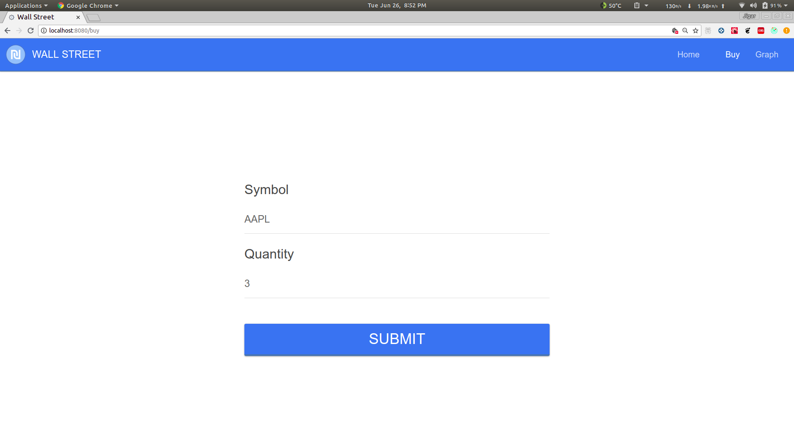
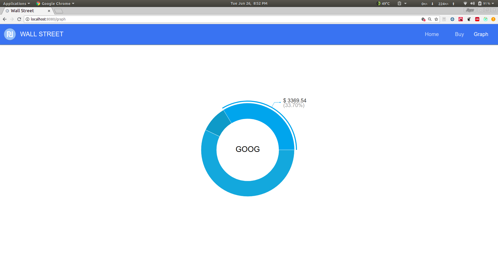

# Wall-Street 

This is a Virtual Trader built using React.

Here are some screenshots =>

## DashBoard



## Buy Page



## Graph Page



To Develop Locally =>

```
yarn run dev-server
```

Built With :heartbeat: by Jigar Chavada
